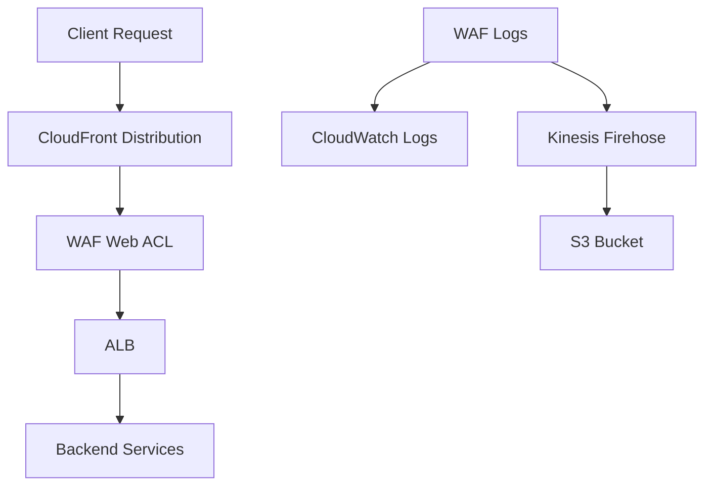

# AWS WAF + CloudFront/ALB Module - Improvement Analysis

## Executive Summary

The `tfm-aws-waf` module demonstrates a solid foundation for AWS WAF deployment with CloudFront and ALB integration. The module is **moderately compliant** with Terraform Registry standards but requires several improvements to achieve enterprise-grade quality and full registry compliance.

**Overall Assessment**: The module provides comprehensive functionality but needs structural improvements, enhanced documentation, and better testing coverage to meet production standards.

**Key Strengths**:
- Comprehensive WAF feature coverage
- Good variable validation
- Flexible configuration options
- Proper resource organization

**Critical Areas for Improvement**:
- Module structure and file organization
- Documentation completeness
- Testing coverage
- Security hardening
- Modern Terraform features adoption

## Critical Issues (Fix Immediately)

### 1. Module Structure Violations
**Issue**: The module combines multiple distinct services (WAF, CloudFront, ALB) in a single module, violating the single responsibility principle.

**Impact**: High - Affects maintainability, reusability, and testing complexity.

**Recommendation**: 
```hcl
# Proposed structure:
modules/
├── waf/
│   ├── main.tf
│   ├── variables.tf
│   ├── outputs.tf
│   └── README.md
├── cloudfront/
│   ├── main.tf
│   ├── variables.tf
│   ├── outputs.tf
│   └── README.md
└── alb/
    ├── main.tf
    ├── variables.tf
    ├── outputs.tf
    └── README.md
```

### 2. Missing Required Documentation Elements
**Issue**: README lacks auto-generated variable and output tables, proper usage examples, and registry-compliant structure.

**Impact**: High - Blocks registry publication.

**Recommendation**: Use `terraform-docs` to generate comprehensive documentation:
```bash
terraform-docs markdown table --output-file README.md --output-mode inject .
```

### 3. Inadequate Testing Coverage
**Issue**: No native Terraform tests (`.tftest.hcl`) present, only basic examples.

**Impact**: High - Critical for production reliability.

**Recommendation**: Implement comprehensive test suite:
```hcl
# tests/basic.tftest.hcl
run "waf_basic_deployment" {
  command = plan
  
  variables {
    waf_web_acl_name = "test-waf"
    enable_rate_limiting = true
  }
  
  assert {
    condition = aws_wafv2_web_acl.main.name == "test-waf"
    error_message = "WAF Web ACL name should match input"
  }
}
```

## Standards Compliance

### 1. Repository Structure
**Current Status**: ✅ Compliant
- Correct naming convention: `tfm-aws-waf`
- Required files present: `main.tf`, `variables.tf`, `outputs.tf`, `README.md`
- Examples directory exists with working examples

**Improvements Needed**:
- Add `CONTRIBUTING.md` for contribution guidelines
- Add `CHANGELOG.md` for version history
- Add `CODE_OF_CONDUCT.md` for community standards

### 2. Version Management
**Current Status**: ✅ Compliant
- Proper version constraints in `versions.tf`
- Uses specified versions: Terraform 1.13.0, AWS Provider 6.2.0

**Improvements Needed**:
- Implement semantic versioning with Git tags
- Add version compatibility matrix
- Document breaking changes

### 3. Documentation Standards
**Current Status**: ⚠️ Partially Compliant
- Basic README structure exists
- Examples provided
- Missing auto-generated sections

**Improvements Needed**:
```markdown
# Add to README.md
## Requirements

| Name | Version |
|------|---------|
| terraform | ~> 1.13.0 |
| aws | ~> 6.2.0 |

## Providers

| Name | Version |
|------|---------|
| aws | ~> 6.2.0 |

## Modules

No modules.

## Resources

| Name | Type |
|------|------|
| aws_wafv2_web_acl.main | resource |
| aws_cloudfront_distribution.main | resource |
| aws_lb.main | resource |
```

## Best Practice Improvements

### 1. Variable Design Enhancements

**Current Issues**:
- Some variables lack comprehensive descriptions
- Missing sensitive data marking
- Inconsistent validation patterns

**Recommendations**:

```hcl
# Enhanced variable definition
variable "waf_web_acl_name" {
  description = "Name of the WAF Web ACL. Must be unique within the scope and region. Used for resource identification and cost allocation."
  type        = string
  
  validation {
    condition     = can(regex("^[a-zA-Z0-9-_]+$", var.waf_web_acl_name))
    error_message = "WAF Web ACL name must contain only alphanumeric characters, hyphens, and underscores."
  }
  
  validation {
    condition     = length(var.waf_web_acl_name) >= 1 && length(var.waf_web_acl_name) <= 128
    error_message = "WAF Web ACL name must be between 1 and 128 characters."
  }
}

# Add sensitive variable for certificates
variable "alb_listener_certificate_arn" {
  description = "ARN of the SSL certificate for ALB listener"
  type        = string
  sensitive   = true
  
  validation {
    condition     = can(regex("^arn:aws:acm:", var.alb_listener_certificate_arn))
    error_message = "Certificate ARN must be a valid ACM certificate ARN."
  }
}
```

### 2. Output Design Improvements

**Current Issues**:
- Some outputs lack comprehensive descriptions
- Missing dependency information
- Inconsistent naming patterns

**Recommendations**:

```hcl
# Enhanced output definition
output "waf_web_acl_id" {
  description = "The ID of the WAF Web ACL. Use this for WAF associations with CloudFront or ALB resources."
  value       = aws_wafv2_web_acl.main.id
  
  # Add dependency information
  depends_on = [
    aws_wafv2_web_acl.main
  ]
}

# Add composite outputs for easier consumption
output "waf_configuration" {
  description = "Complete WAF configuration for external consumption"
  value = {
    web_acl_id   = aws_wafv2_web_acl.main.id
    web_acl_arn  = aws_wafv2_web_acl.main.arn
    web_acl_name = aws_wafv2_web_acl.main.name
    scope        = aws_wafv2_web_acl.main.scope
    capacity     = aws_wafv2_web_acl.main.capacity
  }
}
```

### 3. Security Hardening

**Current Issues**:
- Missing encryption configurations
- Inadequate IAM policy restrictions
- Missing security group configurations

**Recommendations**:

```hcl
# Enhanced security configurations
resource "aws_wafv2_web_acl" "main" {
  # ... existing configuration ...
  
  # Add encryption configuration
  encryption_configuration {
    encryption_algorithm = "AES256"
  }
  
  # Enhanced visibility config
  visibility_config {
    cloudwatch_metrics_enabled = var.enable_cloudwatch_metrics
    metric_name                = "${var.waf_web_acl_name}-metrics"
    sampled_requests_enabled   = var.enable_sampled_requests
  }
}

# Enhanced IAM policy with least privilege
resource "aws_iam_role_policy" "firehose_policy" {
  name = "${var.waf_web_acl_name}-firehose-policy"
  role = aws_iam_role.firehose_role.id
  
  policy = jsonencode({
    Version = "2012-10-17"
    Statement = [
      {
        Effect = "Allow"
        Action = [
          "s3:PutObject",
          "s3:GetObject",
          "s3:ListBucket"
        ]
        Resource = [
          var.waf_logs_s3_bucket_arn,
          "${var.waf_logs_s3_bucket_arn}/*"
        ]
        Condition = {
          StringEquals = {
            "aws:RequestTag/Environment" = var.tags.Environment
          }
        }
      }
    ]
  })
}
```

## Modern Feature Adoption

### 1. Enhanced Validation Features

**Current Status**: Basic validation present
**Improvements**:

```hcl
# Use Terraform 1.9+ validation features
variable "custom_rules" {
  description = "List of custom WAF rules"
  type = list(object({
    name     = string
    priority = number
    action   = string
    type     = string
    search_string = string
    positional_constraint = string
    field    = string
    text_transformation = string
    header_name = optional(string)
  }))
  
  validation {
    condition = alltrue([
      for rule in var.custom_rules : 
        contains(["block", "allow", "count"], rule.action)
    ])
    error_message = "Rule action must be one of: block, allow, count."
  }
  
  validation {
    condition = alltrue([
      for rule in var.custom_rules : 
        rule.priority > 0 && rule.priority <= 100
    ])
    error_message = "Rule priority must be between 1 and 100."
  }
}
```

### 2. Dynamic Block Optimization

**Current Status**: Basic dynamic blocks used
**Improvements**:

```hcl
# Enhanced dynamic rule generation
dynamic "rule" {
  for_each = var.custom_rules
  content {
    name     = rule.value.name
    priority = rule.value.priority
    
    dynamic "action" {
      for_each = rule.value.action == "block" ? [1] : []
      content {
        block {}
      }
    }
    
    dynamic "action" {
      for_each = rule.value.action == "allow" ? [1] : []
      content {
        allow {}
      }
    }
    
    dynamic "action" {
      for_each = rule.value.action == "count" ? [1] : []
      content {
        count {}
      }
    }
    
    statement {
      dynamic "byte_match_statement" {
        for_each = rule.value.type == "byte_match" ? [rule.value] : []
        content {
          search_string         = byte_match_statement.value.search_string
          positional_constraint = byte_match_statement.value.positional_constraint
          field_to_match {
            dynamic "uri_path" {
              for_each = byte_match_statement.value.field == "uri_path" ? [1] : []
              content {}
            }
            dynamic "header" {
              for_each = byte_match_statement.value.field == "header" ? [1] : []
              content {
                name = byte_match_statement.value.header_name
              }
            }
          }
          text_transformation {
            priority = 1
            type     = byte_match_statement.value.text_transformation
          }
        }
      }
    }
  }
}
```

### 3. Local Value Calculations

**Current Status**: Limited use of locals
**Improvements**:

```hcl
# Enhanced local value calculations
locals {
  # Common tags
  common_tags = merge(var.tags, {
    Module    = "tfm-aws-waf"
    Version   = "1.0.0"
    ManagedBy = "terraform"
  })
  
  # Resource naming
  name_prefix = "${var.waf_web_acl_name}-${var.waf_scope == "CLOUDFRONT" ? "cf" : "regional"}"
  
  # WAF rule priorities
  rule_priorities = {
    rate_limiting = 1
    aws_managed   = 2
    sql_injection = 3
    xss_protection = 4
    ip_reputation = 5
    geo_blocking  = 6
    custom_rules_start = 10
  }
  
  # CloudFront configuration validation
  cloudfront_enabled = var.enable_cloudfront && var.waf_scope == "CLOUDFRONT"
  alb_enabled = var.enable_alb && var.waf_scope == "REGIONAL"
  
  # Logging configuration
  logging_enabled = var.enable_waf_logging && (var.enable_kinesis_firehose || var.enable_cloudwatch_metrics)
}
```

## Long-term Recommendations

### 1. Module Composition Strategy

**Recommendation**: Implement a modular architecture:

```hcl
# Root module structure
module "waf" {
  source = "./modules/waf"
  
  web_acl_name = var.waf_web_acl_name
  scope        = var.waf_scope
  # ... other WAF-specific variables
}

module "cloudfront" {
  source = "./modules/cloudfront"
  count  = var.enable_cloudfront ? 1 : 0
  
  distribution_name = var.cloudfront_distribution_name
  web_acl_arn       = module.waf.web_acl_arn
  # ... other CloudFront-specific variables
}

module "alb" {
  source = "./modules/alb"
  count  = var.enable_alb ? 1 : 0
  
  alb_name    = var.alb_name
  web_acl_arn = module.waf.web_acl_arn
  # ... other ALB-specific variables
}
```

### 2. Testing Strategy Development

**Recommendation**: Implement comprehensive testing:

```hcl
# tests/comprehensive.tftest.hcl
run "full_deployment" {
  command = apply
  
  variables {
    waf_web_acl_name = "test-comprehensive"
    enable_cloudfront = true
    enable_alb = true
    enable_waf_logging = true
  }
  
  assert {
    condition = aws_wafv2_web_acl.main.capacity > 0
    error_message = "WAF Web ACL should have capacity > 0"
  }
  
  assert {
    condition = aws_cloudfront_distribution.main[0].enabled == true
    error_message = "CloudFront distribution should be enabled"
  }
  
  assert {
    condition = aws_lb.main[0].internal == false
    error_message = "ALB should be internet-facing by default"
  }
}

run "security_validation" {
  command = plan
  
  variables {
    waf_web_acl_name = "test-security"
    enable_rate_limiting = true
    rate_limit = 100
    blocked_ip_addresses = ["192.168.1.1/32"]
  }
  
  assert {
    condition = length(aws_wafv2_ip_set.blocked_ips) > 0
    error_message = "IP set should be created for blocked IPs"
  }
}
```

### 3. Documentation Enhancement

**Recommendation**: Create comprehensive documentation:

```markdown
# Add to README.md
## Architecture



## Security Considerations

- **WAF Rules**: Configure appropriate rule priorities
- **Rate Limiting**: Set limits based on expected traffic
- **IP Blocking**: Regular updates from threat intelligence
- **Logging**: Enable comprehensive logging for security monitoring

## Cost Optimization

- **CloudFront**: Choose appropriate price class
- **WAF**: Monitor capacity and optimize rules
- **Logging**: Set appropriate retention periods
```

### 4. Maintenance and Lifecycle

**Recommendations**:
1. **Automated Testing**: Implement CI/CD pipeline with automated testing
2. **Version Management**: Use semantic versioning with proper changelog
3. **Security Updates**: Regular security scanning and updates
4. **Performance Monitoring**: Monitor resource usage and optimize configurations
5. **Community Engagement**: Maintain active issue tracking and documentation updates

## Implementation Priority

### High Priority (Immediate)
1. Fix module structure violations
2. Add comprehensive testing
3. Enhance documentation with terraform-docs
4. Implement security hardening

### Medium Priority (Next Sprint)
1. Adopt modern Terraform features
2. Implement modular architecture
3. Add comprehensive validation
4. Create architecture diagrams

### Low Priority (Future Releases)
1. Performance optimizations
2. Advanced monitoring features
3. Multi-cloud support considerations
4. Community features and integrations

## Conclusion

The `tfm-aws-waf` module has strong potential but requires significant improvements to meet enterprise standards and Terraform Registry compliance. The recommended changes will transform it into a production-ready, maintainable, and secure module that follows current best practices.

**Estimated Effort**: 2-3 weeks for high-priority items, 1-2 months for complete transformation.

**Success Metrics**:
- 100% test coverage
- Registry publication approval
- Zero security vulnerabilities
- Comprehensive documentation
- Modular architecture implementation 